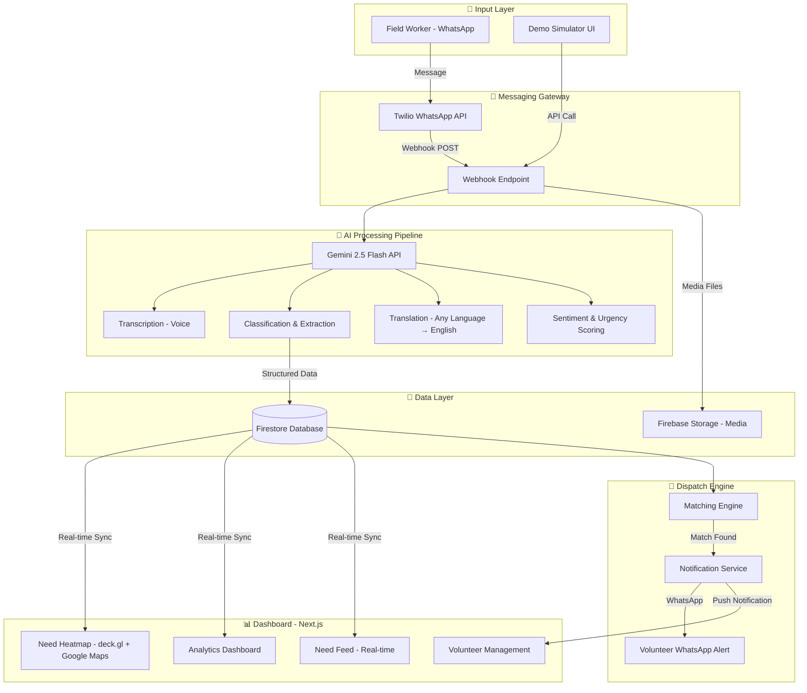

# NeedPulse — Implementation Plan

> **WhatsApp-First AI Field Intelligence for Community Impact**
> GDG Solution Challenge | Theme: Smart Resource Allocation

---

## Problem Statement

Local social groups and NGOs collect important community needs data through paper surveys and field reports. This data is scattered, making it hard to see the biggest problems clearly. There's no smart way to match available volunteers with the tasks and areas where they're needed most.

## Our Solution

**NeedPulse** eliminates friction by meeting field workers where they already are — **WhatsApp**. Field workers send voice notes, photos, or text in any language. Gemini AI extracts structured intelligence, maps it geographically, and auto-dispatches the right volunteers.

---

## User Review Required

> [!IMPORTANT]
> **Phase 2 API Keys**: We are starting Phase 2 (Core Features). To implement the real Gemini AI, Google Maps, and Firebase integration, you will need to add your API keys to `.env.local`.
> 
> **Question**: Do you want me to build the actual API routes and Firebase setup now, and you will add the keys later? Or do you have the keys ready now? If you don't have them, I can build the code such that it works with the real APIs once the keys are added, but gracefully falls back to mock data if the keys are missing.

> [!WARNING]
> **Dependencies**: I need to install `@vis.gl/react-google-maps` and `deck.gl` for the real heatmap integration.

## Open Questions

1. **Cloud Setup** — Have you created the Google Cloud project and Firebase project, or do you need a step-by-step guide?
2. **Phase 2 Execution** — Shall I proceed with writing the Gemini AI processing pipeline (`src/lib/gemini.ts` and `/api/process` route) and Firebase initialization (`src/lib/firebase.ts`)?

---

## Architecture



---

## Tech Stack

| Layer | Technology | Why |
|-------|-----------|-----|
| **Frontend** | Next.js 15 + TypeScript | Fast, SSR, great DX |
| **Styling** | Vanilla CSS + CSS Variables | Per project guidelines |
| **Maps** | Google Maps JS API + deck.gl HeatmapLayer | Google's recommendation (legacy heatmap deprecated) |
| **Backend** | Firebase Cloud Functions (Node.js) | Serverless, Google tech, free tier |
| **Database** | Cloud Firestore | Real-time sync, NoSQL, Google tech |
| **Storage** | Firebase Storage | Voice notes, images from field |
| **AI** | Gemini 2.5 Flash API | Multimodal (text + audio + image), fast, cheap |
| **Messaging** | Twilio WhatsApp Business API | Industry standard, free sandbox |
| **Auth** | Firebase Auth | Google Sign-In for dashboard users |
| **Hosting** | Firebase Hosting | Free, CDN, Google tech |

### Google Technologies Used (GDG Scoring)
1. ✅ **Gemini AI** — Core intelligence engine (multimodal processing)
2. ✅ **Google Maps Platform** — Heatmap visualization + volunteer routing
3. ✅ **Firebase** — Cloud Functions, Firestore, Storage, Auth, Hosting
4. ✅ **Google Cloud** — Project infrastructure

---

## Database Schema (Firestore)

```
📁 needs/
  📄 {needId}
    ├── id: string
    ├── rawMessage: string (original message text)
    ├── rawLanguage: string (detected language e.g. "hi", "te", "en")
    ├── translatedMessage: string (English translation)
    ├── category: string (food | water | shelter | medical | education | infrastructure | other)
    ├── subcategory: string (e.g. "drinking_water", "first_aid")
    ├── urgency: number (1-10, AI-scored)
    ├── sentiment: string (desperate | urgent | moderate | informational)
    ├── peopleAffected: number (estimated by AI)
    ├── location: GeoPoint (lat, lng)
    ├── locationName: string (human-readable address)
    ├── mediaUrls: string[] (photos, voice note URLs in Firebase Storage)
    ├── reporterPhone: string (hashed for privacy)
    ├── reporterName: string (if provided)
    ├── status: string (new | assigned | in_progress | resolved)
    ├── assignedVolunteerId: string | null
    ├── aiConfidence: number (0-1, how confident AI is in extraction)
    ├── createdAt: Timestamp
    └── updatedAt: Timestamp

📁 volunteers/
  📄 {volunteerId}
    ├── id: string
    ├── name: string
    ├── phone: string
    ├── email: string
    ├── skills: string[] (medical | teaching | construction | cooking | driving | logistics)
    ├── availability: string (available | busy | offline)
    ├── location: GeoPoint
    ├── locationName: string
    ├── radius: number (km willing to travel)
    ├── activeAssignments: number
    ├── totalCompleted: number
    ├── rating: number (1-5)
    ├── registeredAt: Timestamp
    └── lastActiveAt: Timestamp

📁 assignments/
  📄 {assignmentId}
    ├── id: string
    ├── needId: string (ref → needs)
    ├── volunteerId: string (ref → volunteers)
    ├── status: string (dispatched | accepted | in_progress | completed | declined)
    ├── matchScore: number (0-100, algorithm confidence)
    ├── matchReason: string (e.g. "Closest volunteer with medical skills")
    ├── dispatchedAt: Timestamp
    ├── acceptedAt: Timestamp | null
    ├── completedAt: Timestamp | null
    └── feedback: string | null

📁 organizations/
  📄 {orgId}
    ├── id: string
    ├── name: string
    ├── adminEmails: string[]
    ├── region: GeoPoint (center)
    ├── regionRadius: number (km)
    └── createdAt: Timestamp
```

---

## Proposed Changes

### Component 1: Project Setup & Configuration

#### [NEW] needpulse/package.json
- Next.js 15 project with TypeScript
- Dependencies: firebase, @google/genai, twilio, deck.gl, @deck.gl/google-maps, @vis.gl/react-google-maps

#### [NEW] needpulse/.env.local
```
NEXT_PUBLIC_GOOGLE_MAPS_API_KEY=
NEXT_PUBLIC_FIREBASE_API_KEY=
NEXT_PUBLIC_FIREBASE_AUTH_DOMAIN=
NEXT_PUBLIC_FIREBASE_PROJECT_ID=
NEXT_PUBLIC_FIREBASE_STORAGE_BUCKET=
GEMINI_API_KEY=
TWILIO_ACCOUNT_SID=
TWILIO_AUTH_TOKEN=
TWILIO_WHATSAPP_NUMBER=
```

#### [NEW] needpulse/firebase.json
- Firebase Hosting + Functions configuration

---

### Component 2: WhatsApp Bot & Webhook (Backend)

#### [NEW] needpulse/src/app/api/webhook/twilio/route.ts
Next.js API route that receives Twilio webhook POSTs:
- Parse incoming WhatsApp message (text, media URL, sender info)
- Download voice notes/images if present → upload to Firebase Storage
- Send to Gemini AI processing pipeline
- Store extracted need in Firestore
- Reply to field worker with confirmation in their language
- Trigger volunteer matching engine

#### [NEW] needpulse/src/lib/twilio.ts
Twilio client wrapper:
- `sendWhatsAppMessage(to, body)` — send reply to field worker
- `sendVolunteerDispatch(to, needSummary, mapsLink)` — dispatch volunteer
- `validateTwilioSignature(req)` — security validation

---

### Component 3: Gemini AI Processing Pipeline

#### [NEW] needpulse/src/lib/gemini.ts
Core AI engine:
- `processFieldReport(message, mediaUrls)` — main entry point
- Handles 3 input types:
  1. **Text** → classify, extract, translate
  2. **Voice Note** → transcribe via Gemini multimodal → then classify
  3. **Photo** → describe scene via Gemini vision → then classify
- Returns structured `NeedData` object

**Gemini Prompt Engineering (the secret sauce):**
```
You are NeedPulse AI, an expert at analyzing field reports from NGO workers.

Given the following field report (which may be in any language), extract:
1. CATEGORY: one of [food, water, shelter, medical, education, infrastructure, other]
2. SUBCATEGORY: specific need type
3. URGENCY: score 1-10 (10 = life-threatening emergency)
4. PEOPLE_AFFECTED: estimated number
5. LOCATION: any location mentions (village, district, landmark)
6. SUMMARY_EN: one-line English summary
7. SUMMARY_ORIGINAL: one-line summary in the original language
8. DETECTED_LANGUAGE: ISO 639-1 code
9. SENTIMENT: one of [desperate, urgent, moderate, informational]
10. KEY_DETAILS: array of specific actionable details

Respond in valid JSON only. Be precise. If uncertain, set confidence lower.
```

#### [NEW] needpulse/src/lib/gemini-matching.ts
AI-powered volunteer matching:
- Takes a need + list of available volunteers
- Gemini ranks candidates based on: skills match, proximity, availability, past performance
- Returns top 3 matches with reasoning

---

### Component 4: Dashboard Frontend (6 Pages)

#### [NEW] needpulse/src/app/page.tsx — Landing Page
- Hero section with animated globe/map showing need pulses
- Stats counters (needs reported, volunteers dispatched, lives impacted)
- "How It Works" — 3-step visual flow
- CTA: "Login to Dashboard" / "Register as Volunteer"

#### [NEW] needpulse/src/app/dashboard/page.tsx — Main Dashboard
- **Real-time Need Feed** — live stream of incoming reports with category badges
- **Quick Stats Cards** — Total needs, Active volunteers, Resolved today, Avg response time
- **Mini Heatmap** — embedded Google Maps with need density
- **Recent Assignments** — latest volunteer dispatches with status

#### [NEW] needpulse/src/app/dashboard/heatmap/page.tsx — Full Heatmap
- Full-screen Google Maps with deck.gl HeatmapLayer
- Filterable by: category, urgency level, time range, status
- Click on cluster → see individual needs in sidebar
- Color coding: 🔴 Urgent (8-10) → 🟡 Moderate (4-7) → 🟢 Low (1-3)

#### [NEW] needpulse/src/app/dashboard/needs/page.tsx — Needs Management
- Sortable/filterable table of all reported needs
- Status pipeline: New → Assigned → In Progress → Resolved
- Click to expand: see original message, AI analysis, media, assignment history
- Manual assign button for edge cases

#### [NEW] needpulse/src/app/dashboard/volunteers/page.tsx — Volunteer Management
- Volunteer directory with skill tags and availability status
- Map view showing volunteer locations
- Performance metrics per volunteer
- Registration form for new volunteers

#### [NEW] needpulse/src/app/dashboard/simulator/page.tsx — Demo Simulator ⭐
**This is the killer demo feature:**
- WhatsApp-like chat interface (green bubbles, familiar UI)
- User types or records a voice note in any language
- Shows real-time AI processing: "Transcribing... Classifying... Matching..."
- Splits screen: left = WhatsApp sim, right = dashboard updating live
- Pre-loaded demo scenarios:
  - Hindi voice: "गांव में पानी की बहुत कमी है, 200 लोग प्रभावित हैं"
  - Telugu text: "మా పాఠశాలకు పుస్తకాలు అవసరం"
  - English + photo: "Flooding in sector 5, families displaced" + flood image
- Each scenario triggers the full pipeline and updates the heatmap in real-time

---

### Component 5: Shared Libraries & Components

#### [NEW] needpulse/src/lib/firebase.ts
Firebase client initialization (Firestore, Storage, Auth)

#### [NEW] needpulse/src/lib/matching-engine.ts
Volunteer matching algorithm:
```
Score = (skillMatch × 0.4) + (proximityScore × 0.3) + 
        (availabilityScore × 0.2) + (reliabilityScore × 0.1)
```

#### [NEW] needpulse/src/components/NeedCard.tsx
Reusable card showing a single need report with category icon, urgency badge, location, time

#### [NEW] needpulse/src/components/VolunteerCard.tsx
Volunteer profile card with skills, availability indicator, active assignments

#### [NEW] needpulse/src/components/StatsCard.tsx
Animated counter card for dashboard metrics

#### [NEW] needpulse/src/components/ChatSimulator.tsx
WhatsApp-like chat UI component for the demo simulator

#### [NEW] needpulse/src/components/HeatmapView.tsx
Google Maps + deck.gl heatmap wrapper component

#### [NEW] needpulse/src/components/NeedFeed.tsx
Real-time scrolling feed of incoming needs with live updates

#### [NEW] needpulse/src/styles/globals.css
Design system with CSS variables:
- Dark mode primary with vibrant accent colors
- Category color palette (medical=red, water=blue, food=green, etc.)
- Glassmorphism cards
- Smooth animations and transitions
- WhatsApp-accurate chat bubble styles

---

## UI Design Vision

### Color Palette
| Token | Color | Usage |
|-------|-------|-------|
| `--bg-primary` | `#0a0e1a` | Main background (dark) |
| `--bg-surface` | `#111827` | Card backgrounds |
| `--bg-glass` | `rgba(17,24,39,0.7)` | Glassmorphism panels |
| `--accent-primary` | `#6366f1` | Primary actions (indigo) |
| `--accent-success` | `#10b981` | Resolved, available |
| `--accent-warning` | `#f59e0b` | Moderate urgency |
| `--accent-danger` | `#ef4444` | High urgency |
| `--accent-info` | `#3b82f6` | Water/information |
| `--text-primary` | `#f9fafb` | Main text |
| `--text-secondary` | `#9ca3af` | Secondary text |
| `--whatsapp-green` | `#25D366` | WhatsApp branding |
| `--whatsapp-dark` | `#1a2e35` | Chat background |

### Category Icons & Colors
| Category | Emoji | Color |
|----------|-------|-------|
| Medical | 🏥 | `#ef4444` red |
| Water | 💧 | `#3b82f6` blue |
| Food | 🍲 | `#f59e0b` amber |
| Shelter | 🏠 | `#8b5cf6` purple |
| Education | 📚 | `#6366f1` indigo |
| Infrastructure | 🏗️ | `#6b7280` gray |

### Typography
- **Headings**: `Inter` (Google Fonts) — clean, modern
- **Body**: `Inter` — consistent
- **Code/Data**: `JetBrains Mono` — for stats and technical data

---

## Build Phases

### Phase 1: Foundation (Day 1-2)
- [ ] Initialize Next.js project with TypeScript
- [ ] Set up Firebase project (Firestore, Storage, Auth, Hosting)
- [ ] Configure environment variables
- [ ] Build design system (globals.css with all tokens)
- [ ] Create landing page with hero + animations
- [ ] Set up Firestore collections with seed data

### Phase 2: AI Pipeline (Day 3-4)
- [ ] Integrate Gemini API with multimodal support
- [ ] Build text processing pipeline (classify, extract, translate)
- [ ] Build voice note processing (upload → Gemini transcribe → classify)
- [ ] Build image processing (upload → Gemini vision → classify)
- [ ] Test with multilingual inputs (Hindi, Telugu, Tamil, English)
- [ ] Fine-tune prompts for accuracy

### Phase 3: WhatsApp Integration (Day 5)
- [ ] Set up Twilio account + WhatsApp Sandbox
- [ ] Build webhook API route
- [ ] Connect webhook → Gemini pipeline → Firestore
- [ ] Build reply system (confirmation in original language)
- [ ] Test end-to-end: WhatsApp → AI → Database

### Phase 4: Dashboard (Day 6-8)
- [ ] Build dashboard layout with sidebar navigation
- [ ] Real-time need feed with Firestore onSnapshot
- [ ] Google Maps + deck.gl heatmap integration
- [ ] Needs management page with filtering/sorting
- [ ] Volunteer management page
- [ ] Stats cards with animated counters
- [ ] Responsive design + dark mode polish

### Phase 5: Matching & Dispatch (Day 9)
- [ ] Build matching engine (score algorithm)
- [ ] Gemini-powered smart matching (AI ranks candidates)
- [ ] Auto-dispatch via WhatsApp with Google Maps directions link
- [ ] Assignment tracking and status updates

### Phase 6: Demo Simulator & Polish (Day 10-11)
- [ ] Build WhatsApp chat simulator UI
- [ ] Pre-load demo scenarios (multilingual)
- [ ] Split-screen demo mode (chat left, dashboard right)
- [ ] Add real-time processing animations
- [ ] Performance optimization
- [ ] Bug fixes and edge cases

### Phase 7: Deployment & Submission (Day 12)
- [ ] Deploy to Firebase Hosting
- [ ] Record demo video (2 min max)
- [ ] Write project documentation
- [ ] Prepare pitch deck
- [ ] Submit to GDG

---

## Demo Script (For Judges)

> **The 2-Minute Demo That Wins:**

1. **[0:00-0:15]** Open dashboard showing empty heatmap. "Right now, this NGO has no visibility into community needs."

2. **[0:15-0:45]** Open WhatsApp simulator. A field worker in rural India sends a **Hindi voice note**: *"गांव में साफ पानी नहीं है, करीब 200 परिवार प्रभावित हैं, बच्चे बीमार हो रहे हैं"* (There's no clean water in the village, about 200 families affected, children are getting sick)

3. **[0:45-1:00]** Watch AI process in real-time:
   - ✅ Transcribed from Hindi
   - ✅ Category: Water 💧
   - ✅ Urgency: 9/10 🔴
   - ✅ People affected: ~200 families
   - ✅ Location mapped

4. **[1:00-1:15]** Dashboard updates: red pulse appears on heatmap, need card slides into feed

5. **[1:15-1:30]** Matching engine activates: "Found Priya — water sanitation volunteer, 3km away, available now"

6. **[1:30-1:45]** Priya receives WhatsApp dispatch: "Urgent water crisis at [location]. 200 families affected. [Google Maps directions link]"

7. **[1:45-2:00]** Show 3 more pre-loaded scenarios fire rapidly in different languages — heatmap lights up, dashboard comes alive. "This is NeedPulse — turning scattered field reports into coordinated action."

---

## File Structure

```
needpulse/
├── src/
│   ├── app/
│   │   ├── page.tsx                          # Landing page
│   │   ├── layout.tsx                        # Root layout
│   │   ├── api/
│   │   │   ├── webhook/twilio/route.ts       # Twilio webhook
│   │   │   ├── process/route.ts              # AI processing endpoint
│   │   │   └── match/route.ts                # Matching endpoint
│   │   └── dashboard/
│   │       ├── layout.tsx                    # Dashboard layout + sidebar
│   │       ├── page.tsx                      # Main dashboard
│   │       ├── heatmap/page.tsx              # Full heatmap view
│   │       ├── needs/page.tsx                # Needs management
│   │       ├── volunteers/page.tsx           # Volunteer management
│   │       └── simulator/page.tsx            # Demo simulator ⭐
│   ├── components/
│   │   ├── landing/
│   │   │   ├── Hero.tsx
│   │   │   ├── HowItWorks.tsx
│   │   │   └── Stats.tsx
│   │   ├── dashboard/
│   │   │   ├── Sidebar.tsx
│   │   │   ├── StatsCard.tsx
│   │   │   ├── NeedCard.tsx
│   │   │   ├── NeedFeed.tsx
│   │   │   ├── VolunteerCard.tsx
│   │   │   └── HeatmapView.tsx
│   │   └── simulator/
│   │       ├── ChatSimulator.tsx
│   │       ├── ChatBubble.tsx
│   │       └── ProcessingAnimation.tsx
│   ├── lib/
│   │   ├── firebase.ts                       # Firebase client init
│   │   ├── gemini.ts                         # Gemini AI pipeline
│   │   ├── gemini-matching.ts                # AI volunteer matching
│   │   ├── twilio.ts                         # Twilio client
│   │   ├── matching-engine.ts                # Scoring algorithm
│   │   └── types.ts                          # TypeScript interfaces
│   └── styles/
│       └── globals.css                       # Design system
├── public/
│   ├── demo-audio/                           # Pre-recorded voice notes for demo
│   └── images/                               # Landing page assets
├── .env.local
├── firebase.json
├── next.config.ts
├── tsconfig.json
└── package.json
```

---

## UN SDG Alignment (Critical for GDG Judging)

NeedPulse directly supports:

| SDG | How |
|-----|-----|
| **SDG 1: No Poverty** | Connects vulnerable communities with aid resources |
| **SDG 2: Zero Hunger** | Routes food-related needs to food bank volunteers |
| **SDG 3: Good Health** | Prioritizes medical emergencies, dispatches health workers |
| **SDG 6: Clean Water** | Identifies water crises, connects with sanitation teams |
| **SDG 10: Reduced Inequalities** | Serves underrepresented communities via multilingual voice-first UX |
| **SDG 11: Sustainable Cities** | Builds data-driven infrastructure insights from field reports |
| **SDG 17: Partnerships** | Bridges NGOs, volunteers, and communities through technology |

---

## Verification Plan

### Automated Tests
- Unit tests for Gemini prompt → structured output parsing
- Unit tests for matching engine scoring
- Integration test: mock WhatsApp message → Firestore document created
- E2E test: simulator scenario → heatmap update

### Manual Verification
- Send real WhatsApp messages in Hindi, Telugu, English → verify correct classification
- Record voice note in Hindi → verify transcription + translation accuracy
- Upload photo of flooding → verify Gemini vision description
- Verify heatmap renders correctly on Google Maps
- Test volunteer dispatch → verify WhatsApp message received
- Mobile responsiveness check on dashboard
- Full demo script rehearsal (timed to 2 minutes)

### Browser Testing
- Test landing page animations in Chrome, Firefox, Edge
- Test dashboard real-time updates (Firestore onSnapshot)
- Test map interactions (zoom, pan, click clusters)
- Test simulator chat UI (type, voice record, scenario playback)
